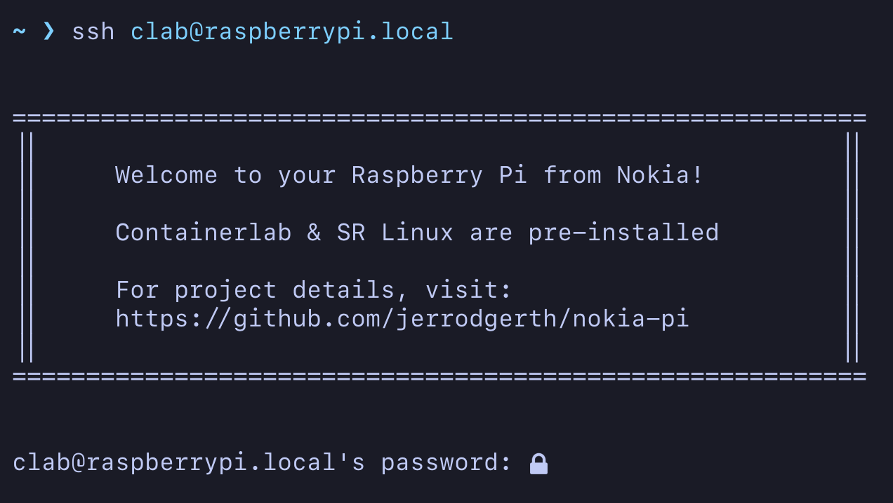
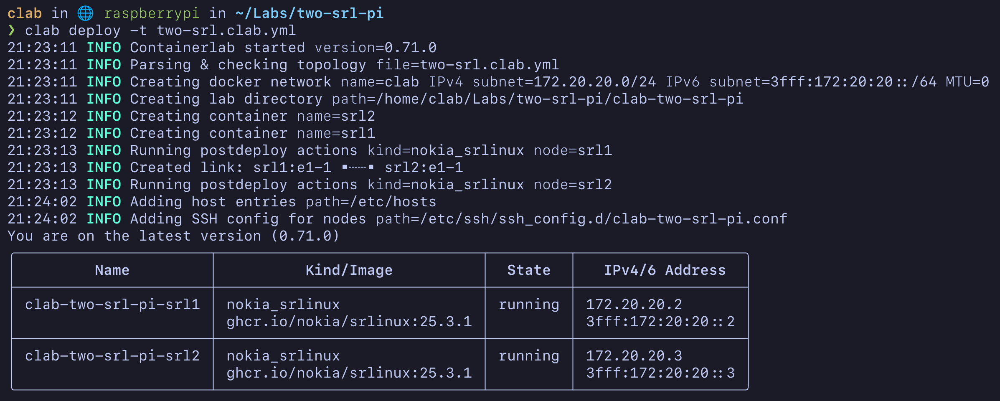
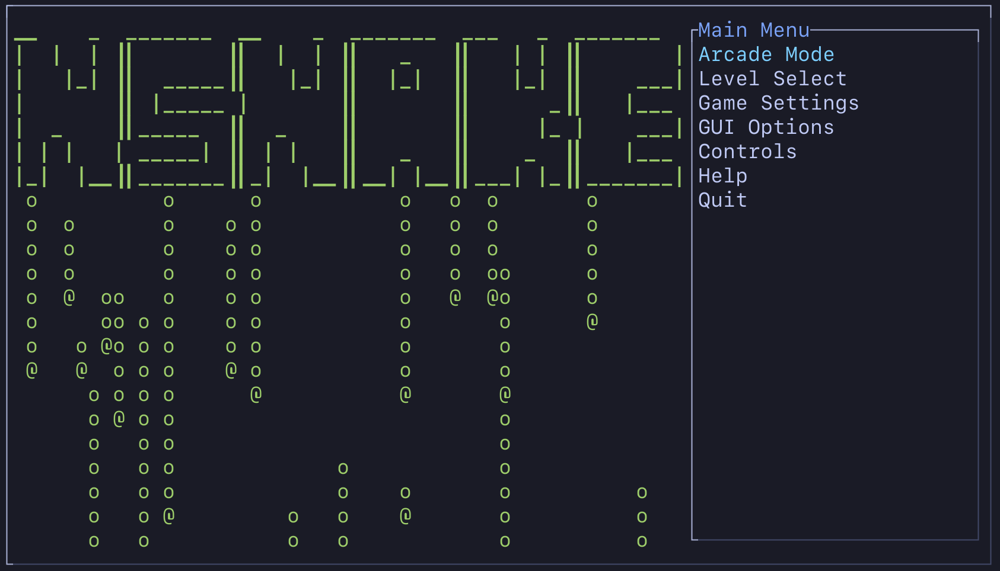

# Raspberry Pi 5 Courtesy of Nokia


## Background

In my experience, if there is one word to summarize the Raspberry Pi it would be *fun*.  The [Raspberry Pi](https://www.raspberrypi.com) is a small, accessible computing device meant to promote computer science education and hobbyist projects.  Search the web and you will find all manner of *fun* things people have built using a Raspberry Pi (or Pi's).

So when the Nokia team announced support for the ARM CPU architecture in Containerlab and SR Linux, the building blocks for *funner* network labs were in place.  The only missing piece were some bright, colorful, custom 3D-printed cases.  ;-)

So we hope you have *fun* with your Raspberry Pi pre-loaded with Containerlab and SR Linux.


## First boot

The Raspberry Pi 5 has been setup as a headless server.  Connect the Pi to your network via the Ethernet port.  DHCP is enabled along with SSH for remote login.  Find the IP address that was assigned or use the `raspberrypi.local` hostname if mDNS is working.  A user `clab` with password `Clab123!` has been pre-configured.

Start an SSH session -- `ssh clab@raspberrypi.local` -- and you should see this login screen:



Once logged in, you can start the included SR Linux lab and get to work.


## SR Linux Lab with MultiCLI

The `~/Labs` directory contains an example lab named `two-srl-pi`.  This lab is based off of the [Two SR Linux nodes](https://containerlab.dev/lab-examples/two-srls/) example from [Containerlab.dev](https://containerlab.dev) and also incorporates configuration from the [MultiCLI](https://github.com/srl-labs/MultiCLI) project.

To start the lab, navigate to the lab directory and start the lab via the `clab deploy` command.

```
cd ~/Labs/two-srl-pi
clab deploy -t two-srl.clab.yml
```



Next, login to one of the SRL nodes, using `admin@clab-two-srl-pi-srl1` and the default password of `NokiaSrl1!`.  For future reference, all credentials are stored in `~/Labs/two-srl-pi/README.txt`.


From here, you can verify connectivity by pinging the other SRL node, `ping network-instance default 192.168.0.1 -c 5`


Here are a few other SRL commands to try:
- `show version`
- `show interface brief` or `show interface brief | grep up`
- `info interface ethernet-1/1` or `info from state interface ethernet-1/1`
- `show network-instance default route-table all` or `show network-instance default route-table all | as json`

The [Learn SR Linux]() portal has many resources for getting up to speed with the SR Linux NOS.  In particular, you may want to check out the [SR Linux CLI](https://learn.srlinux.dev/get-started/cli/) tutorial.

To exit the SRL CLI use `quit`

To stop a running lab, `clab destroy` (from the directory containing the .yml file)

To completely remove a lab, `clab destroy -c` (from the directory containing the .yml file)


## Image Notes

[Raspberry Pi OS Lite](https://www.raspberrypi.com/documentation/computers/os.html) was used as the starting point for the image on the included microSD card.  Raspberry Pi OS is built on Debian and the current release is based on [Debian Trixie](https://www.raspberrypi.com/news/trixie-the-new-version-of-raspberry-pi-os/).  If you would like to attach a monitor and other peripherals to use the Pi as a desktop, follow these [instructions](https://www.raspberrypi.com/documentation/computers/os.html#convert-raspberry-pi-os-lite-into-raspberry-pi-os-desktop).

Several utilities were added for a more refined user experience...

- [Starship](https://starship.rs) prompt with [no-nerd-font](https://starship.rs/presets/no-nerd-font) preset
- [Fastfetch](https://github.com/fastfetch-cli/fastfetch) for system info 
- [btop](https://github.com/aristocratos/btop) as a modern resource monitor 
- [lazydocker](https://github.com/jesseduffield/lazydocker) a TUI for all things docker
- [eza](https://eza.rocks) a modern, maintained replacement for `ls` 
- [zoxide](https://github.com/ajeetdsouza/zoxide) a smarter `cd` command 
- [bat](https://github.com/sharkdp/bat) better `cat` 

And a [~/.bash_aliases](misc/.bash_aliases) file is included for some handy CLI shortcuts

```
alias ls='eza'
alias ll='eza -l'
alias la='eza -al'
alias tree='eza --tree'

alias ..='cd ..'
alias ...='cd ../..'

alias mkp='mkdir -p'
alias rmf='rm -f'
alias rmr='rm -rf'
alias c='clear'
alias h='history'

alias bat='batcat'
alias b='batcat'
alias bt='btop'
alias fast='fastfetch'
alias lzd='lazydocker'
alias snake='nsnake'
```


## nSnake 

And it wouldn't be a Nokia thing if we didn't mention something related to phones....  So, play a game of [Snake](https://github.com/alexdantas/nSnake) if you are bored.



